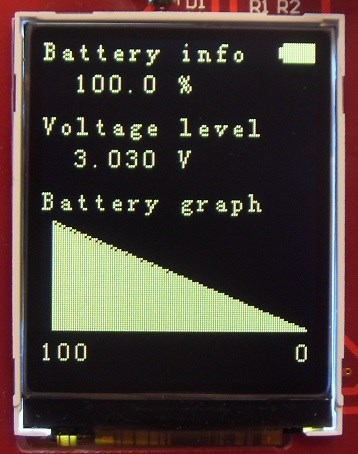
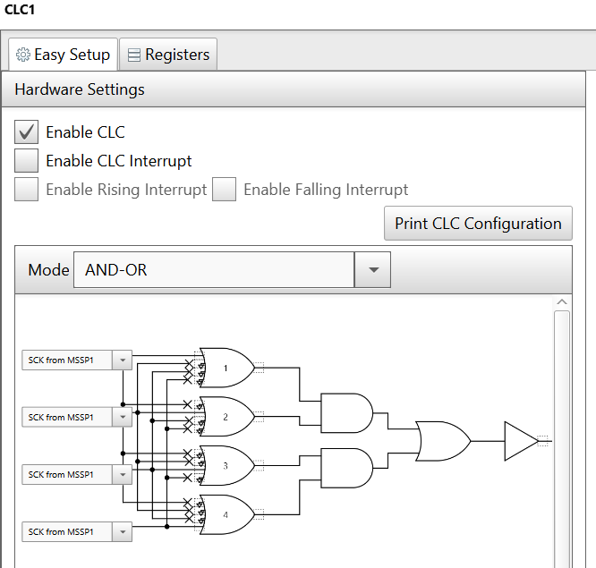
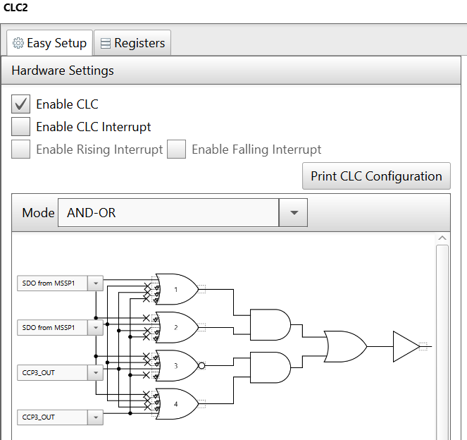
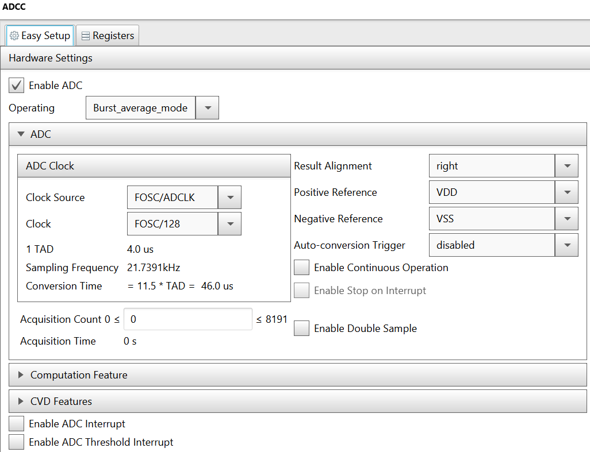
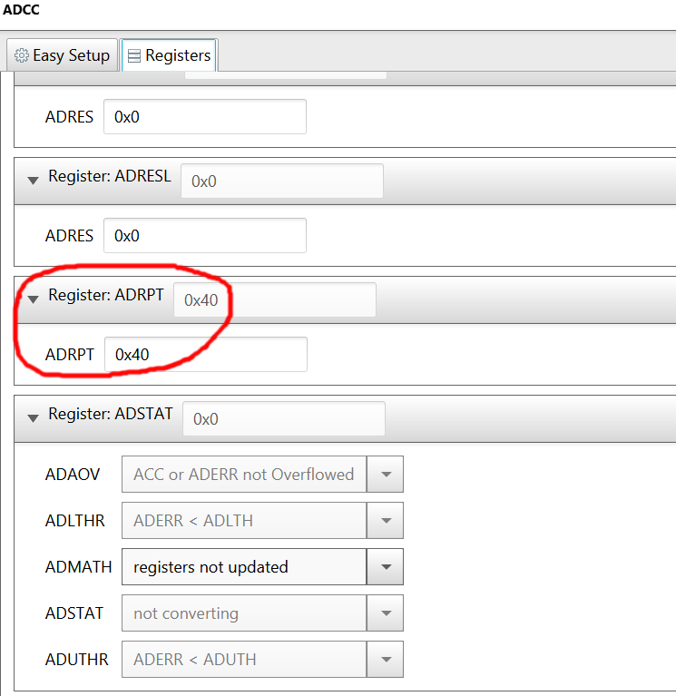
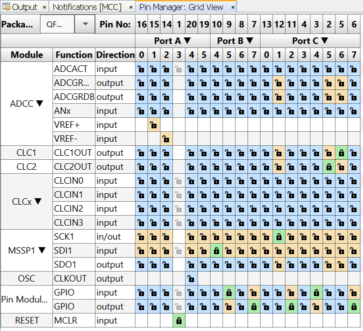
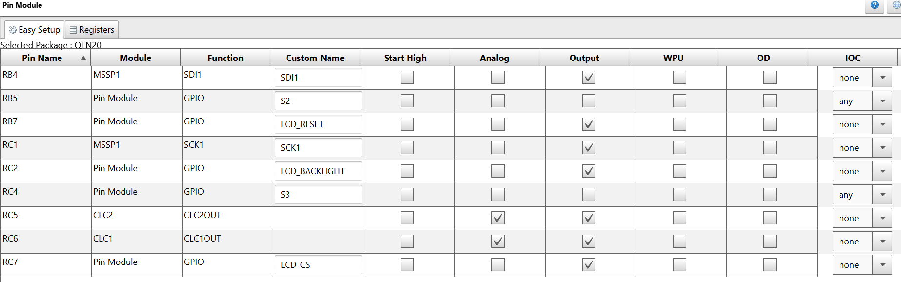

  <article class="markdown-body entry-content p-3 p-md-6" itemprop="text">

# Introduction
The PIC16F184xx family has a new Analog to Digital Converter with Computation (ADCC) with a 12-bit resolution. This project shows how the PIC can internally measure its Vdd using the ADCC and FVR.

# Description
In this example we will be using the PIC16F18446 Sensor Board. Battery (Vdd) level measurement is performed while the display is turned on. The percentage level of the remaining charge in the batteries is shown as a battery icon with proportional filing in the top-right corner of the display. Additionally, the battery voltage in Volts and percentage graph are displayed.

To get the Vdd voltage, ADCC is used to measure the FVR (which is configured to 1.024V) with Vdd as positive reference. Then the Vdd is calculated using this formula: Vdd = 1.024V * 4096 / ADC_Reading.

# MCC Settings

Here are the settings used for MSSP, CLC, FVR, and ADCC. MSSP + CLC are used for the LCD control.
### MSSP Settings

### CCL Settings

### FVR Settings

### ADCC settings

ADRPT register is set to 0x40, to average a burst of 64 samples.

### PIN Grid

### PIN Module

